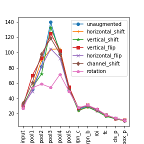
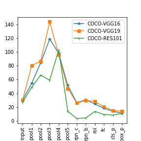

# ID_CNN
Intrinsic Dimension of Convolutional Neural Networks

One of the geometric properties of representing data in neural network is Intrinsic Dimension i.e. minimum number of co-ordinates required to represent data without information loss. Local ID estimators compute in local subspaces of data representation. Global ID estimators compute over whole data point representation. Both global and local ID estimators can be used for estimation in alternate data neighbourhood. Our aim is to estimate ID at different layers for object detection networks and determine the relationship between average precision of augmented data and estimated ID. ID characteristics are distinguishable for normal and adversarial generated samples in local space. This motivates us to experiment with ID estimation in global space. TwoNN algorithm is implemented in our paper to estimate ID.

## Repository Structure

    .
    ├── FD                   
    ├── ID                          # code for calculating Intrinsic Dimensionality
    ├── Notebooks                   # Notebooks to plot ID
    ├── Plots                       # Saved Plots
    ├── analyze                     # code to estimate ID for different networks
    ├── backbone                    # backbone networks VGG and resnet from pytorch
    └── Dataset                     # Folder is not uploaded due to size of data set. This is the structure in which data should be stored.
        └── KITTI                   #contains KITTI dataset for training and evaluation
            ├── testing             #folder contains the augmented data sets.
            └── training
        └── COCO                    #contains COCO dataset for training and evaluation
            ├── train2017
            └── test2017            #folder contains the augmented data sets.
        └── VOCdevkit               #contains VOC data for training and evaluation
            ├── VOC2007             #folder contains the augmented data sets.
            └── VOC2012
    ├── data                        # dataset class files to load data
    ├── models                      # faster rcnn and retinanet model codes from pytorch
    ├── scripts                     # bash scripts to run the files
    ├── utils                       # utils files required for training
    ├── Fractal_Dimension.py        # code to calculate the Fractal dimension
    ├── augmentation.py             # code to create augmented data sets
    ├── evaluate.py                 # code to evaluate test data on trained models
    ├── resize.py                   # code to resize test images during augmentation and for training
    ├── train.py                    # training code
    ├── transforms.py               # pytorch referenced file minor changes as per requirements
    ├── engine.py                   # pytorch referenced file
    ├── utils.py                    # pytorch referenced file
    ├── coco_eval.py                # pytorch referenced file
    ├── coco_utils.py               # pytorch referenced file
    ├── requirements.txt            # Requirements File
    └── README.md
    
## Datasets 
 
| Dataset | **KITTI** | **COCO** | **VOC** |
| -------- | --------- | --------- | --------- | 
| Number of Classes | 10 | 91 | 20 |
| Training samples | 5500 | 80000| 13500 |
| val samples | 1981 | 38000 | 3625 |
| Image Sizes | 1200 x 1200, 300 x 300 | 300 x 300 | 300 x 300 |
| ID calculation | testing | test2017 | VOC2007|
|Number of Images | 400, 2000 | 2000 | 2000 |

**Augmentations**
- *Horizontal Shift* - Horizontal shift or translation is shifting the image left or right based on a ratio that defines how much maximum to shift.
- *Vertical Shift* - Vertical shift or translation is shifting the image top or bottom based on a ratio that defines how much maximum to shift.
- *Channel Shift* - In Channel shift, a random amount of value is added to all the channels of the images chosen from the range specified. (In our paper, 50)
- *Horizontal Flip* - It takes a boolean variable that defines if a horizontal flip is to be performed or not. There is an inbuilt function in OpenCV cv2.flip which is used to perform just this operation.

- *Vertical Flip*- Like a horizontal flip, it is performed using cv2.flip however, its second argument should be 0.
- *Rotation* - Rotating the image by a certain angle. (In our paper, 45 degrees)

To create the augmented data sets run `augmentation.py` . 

## Training and Evaluation

To train the models, scripts are in `scripts` directory. For evaluation run `evaluate.sh` by changing the parameters in the code for different augmentations.

**Average Precision IOU@0.50**

| Model | KITTI | COCO | VOC |
| ----- | ----- | ----- | ----- |
| VGG-16 Faster RCNN | 43.4 | 36.5 | 57.6 |
| VGG-19 Faster RCNN | 49.4 | 37.0 | 49.6 |
| Res-101 Faster RCNN | - | - | - |
| VGG-16 RetinaNet | 34.2 | - | - |
| VGG-19 RetinaNet | 35.0 | - | - |
## Plots

The above plot is the median of Intrinsic dimension of all datasets on Faster RCNN with VGG-16 and VGG-19 backbones.

The plot on the left compares COCO and VOC data set on models trained on VOC and COCO data. We use alternate model for test data. The right plot shows median ID of KITTI data on RetinaNet with VGG-16 and VGG-19 backbones.

The plots i) KITTI  ii} VOC  iii) COCO are for Faster RCNN on VGG-16 for different augmentations of the data sets.

Comparison of KITTI, COCO and VOC on Faster RCNN with VGG-16, VGG-19 and Res-101 backbones.

## Fractal Dimension
FD is calculated using box count method. Please refer to link in refernces for more information.

           

            
 i) KITTI- *Top*       ii) COCO - *Middle*       iii) VOC - *Bottom*
The boxplots show that there is less deviation among the augmented data sets for the same 2000 images used for calculation of ID using Two NN algorithm. There is however an interesting observation in case KITTI Vertical shift where the FD has a large standard deviation and ID is high in second pooling layer in the Faster RCNN model. There might be some relation between them. But, due to uncorrelated dimensionality between ID and FD for all other data sets, we doubt that FD estimated using box count method and ID estimated using Two NN algorithm has no direct or indirect relationship.

## Conclusions
- While estimation of ID, bounding box with highest score is used as input to ROI pooling layer from the region proposal network due to constraint of our ID estimation algorithm where each image is represented as a point at layers of our network leads to no change in ID at layers after RPN. What happened while using bounding box with lowest scores? Our results did not have an impact because average precision depends on all objects predicted by the network. Another reason is removal of images from our estimation process if there are no predictions for bounding boxes, because in such scenarios there will be no data points for representation at ROI pooling layer.age but ID follows similar structure when plotted against the layers used for estimating ID.
- Hunchback shape is evident in trained networks whereas in untrained networks the network displays a flat profile. In our experiments, flatter trajectory for rotated images is observed, which indicate that rotated images have poor representation in the manifold. It is proven from the evaluation of rotated images where average precision is low compared to other augmentations over all data sets. Hunchback profile for other augmented data sets with varying ID at different layers is present, hence they are represented better within network in comparison to rotated images.
- Vertical shift in KIITI has high ID ~ 187 whereas the normal data has ID ~ 84 at pool1 layer. It may be because of irrelevant features like filling of resized image with interpolation that attribute to increase in ID and due to original image size of KITTI being around 1200 x 350. When image is shifted vertically and empty pixels are filled by interpolation, the added pixels are irrelevant features to the network. Comparing with COCO and VOC, large difference between vertical shift and normal data is absent. 
- ID of classification layer does not predict the object detection performance in contradiction to Reference 1 that corresponds to relationship between last hidden layer and accuracy of classification. In our case last hidden layers(fc layer) ID also have no relationship with AP .
- While comparing our observations are that ID is lower in classification layer in comparison to bounding box layer for KITTI and VOC data, but for COCO data the phenomenon is reversed with higher ID in classification layer than bounding box layer. One possibility is that the network generalizes poorly at classification layer due to large number of classes(n=91). 
- Comparing Faster RCNN median ID with res-101 backbone, we observe that the highest ID is acheived in later layers than VGG backbone that indicates that irrelevant features are learned during later convolutional layer in the network. But our network did not perform well in terms of AP with resnet backbone. So, we cannot be completely sure about this conclusion.

## References
1. Intrinsic Dimension calculation - https://github.com/ansuini/IntrinsicDimDeep
2. KITTI dataset class - https://github.com/keshik6/KITTI-2d-object-detection
3. Image augmentations - https://towardsdatascience.com/complete-image-augmentation-in-opencv-31a6b02694f5
4. Fractal Dimension - https://github.com/ajaychawda58/Fractal-Dimension
5. All codes for backbones and models for training and evaluation purpose are referred from Pytorch source code.

## Notes

*Please view this page in normal theme and not in dark theme for viewing of labels in plots*
